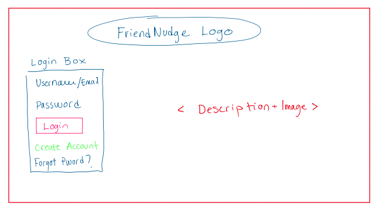
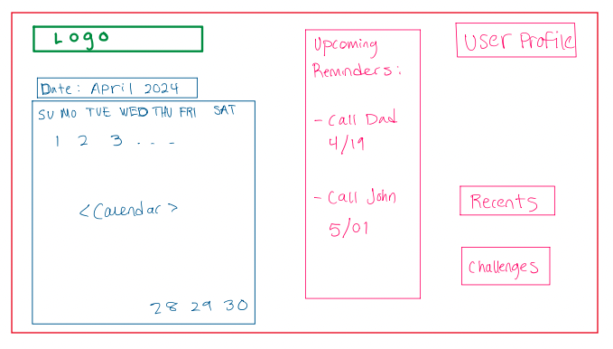

# Page 1 - Liam
## Title: Login Page

### Description:
The login page is the entry point for users to access their Friend Nudge account. It features a simple and clean design with fields for username/email and password, along with a login button. There's also an option to create a new account for first-time users.

### Mockup:

### Parameters:
- None (This is the initial page)

### Data Needed:
- User credentials database (for authentication)

### Link Destinations:
- Login button: Redirects to Calendar page (Page 2) upon successful authentication
- "Forgot Password?": Links to a password reset page
- "New Account": Links to a registration page

### List of Tests:
1. Test successful login with valid credentials
2. Test login failure with invalid credentials
3. Test error message display for empty fields
4. Test "Forgot Password?" link functionality
5. Test "New Account" link functionality

# Page 2 - Liam
## Title: Calendar Page

### Description:
The Calendar page displays a monthly view of scheduled friend interactions. It shows upcoming reminders for contacting friends and allows users to add new reminders or modify existing ones.

### Mockup:

### Parameters:
- userID: ID of the current user
- currentDate: The current date to determine which month to display

### Data Needed:
- User's friend list
- Scheduled reminders for the displayed month
- User's preferences for reminder frequency

### Link Destinations:
- User Profile: Links to the user's profile page
- Add button: Opens a form to add a new reminder
- Date cells: Clicking on a date opens a detail view for that day
- Reminder items: Clicking on a reminder opens its detail/edit view
- Recents: Links to the Recents page
- Challenges: Links to the Weekly Challenges page
- More: Links to additional options or settings

### List of Tests:
1. Test correct display of the current month and year
2. Test navigation between months (previous and next)
3. Test accurate population of reminders on the calendar
4. Test "Add" functionality for creating new reminders
5. Test clicking on a date cell to view details
6. Test clicking on a reminder to view/edit details
7. Test display of upcoming reminders list
8. Test navigation to Recents, Challenges, and More pages
9. Test user profile link functionality

# Page 3 - Brady

## Title: Recents

### Mockup:

### Parameters:
    -userID: ID of current user
    -curDate: current date
    -freindID: ID of friend user
### Data Needed: 
    -username
    -friend list
    -last messaged
    -relationship type
    -freind.next_message_date
### Link Destinations:
    -When clicking on name of friend
        -it brings up the friends profile
    -Top bar with links to other pages
### List of Tests:
    - Test to verify page was brought up
    - Test to verify that friends are correct
    - Test to verify that friend profile is correct
    - Test to verify that the last messaged was correct
    - Tests to verify all link destinations work

# Page 4 - Brad

# Page 5 - Quinn

## Title: Weekly Challenges

### Description: 
    A display page of weekly challenges that can be clicked on and accepted.
    It includes the title, a list of challenges, start and expiration date of the challenge.
    It also includes participation status. 
    If a joint challenge is chosen an invite to the other user will be sent to the other users challenges page. 
 
### Parameters:
    -userID: ID of current user 
    -current_week: the current week

### Data:
    -A list of challenges with descriptions
    -The friends list of the user
    

### Link to page:
    - A link to the home page redirects to home page
    - Maybe a link to a page that contains the description of the challenge but that could also be done on the same page

### Tests List: 
    -A test to verify that the correct display of challenges, with correct participation status
    -A test to verify the correct display of friends if there are joint challenges
    -A test to verify redirect to homepage link
    -A test to verify correct userID and current_week
