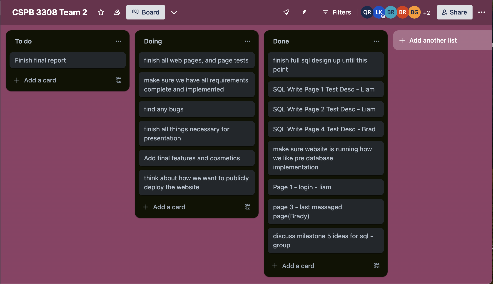

# FriendNudge

## Team #2
**Team Name:** Team 2

**Product Name:** FriendNudge

## Weekly Status

**Milestone 3**

- **What we did**  
  - Went over current trello board and added what we our looking to do for milestone 4 
  - Went over all milestones to understand where we are and where we need to be and what will get us there
  - Decided on a rough framework for the layout of the website
  - Moved weekly meeting for next week to Monday
  - Decided on how we will move forward to the next area of the project

**Milestone 4**
    

- **What we did**
  - Continued our discussion in prep for milestone 4
  - Continued to discuss website layout and routes
  - Officially assigned everyone to their respective pages
  - Discussed backend frameworks to use
  - Set goals to be completed by next week's meeting
 
**Next Meeting**

- **What we did**
  - Started working on webpages
  - Started the backend framework so everything works cohesively
  - Discussed what our next steps would be
  - Designed to greater detail what the website would look like

**Next Meeting**

- **What we did**
  - Finished all we needed to understand and implement our pages
  - Discussed what testing we needed to complete
  - We started to look at and discuss week 5 to make sure we knew what we needed to do
  - Went over what we needed out of the sql tables and how we think we will make them
 

**Next Meeting**

- **What we did**
  - Have our sql design and are moving onto to implementation next
  - Made sure we have our backend framework running properly
  - Have exact design for our website pre-sql implementation and possible problems
  - Started to look ahead to whats next

**Next Meeting**

- **What we did**
  - Made sure everyone knew what next steps were
  - Discussed how much longer we needed before everything is up and running
  - Visual walk through of the websites and database to make sure everyone understands everything we have so far
  - Discussed what our final steps are and our attack plan, challanges we still have and how to attack them
  - Discussed things we need to get rid of and other things we still need to add

**Next Meeting**

- **What we did**
  - determined final features that were going to make it into the ultimate submission
  - verify everyone completed their tasks
  - discussed finishing final report
  - discussed deployment strategies 